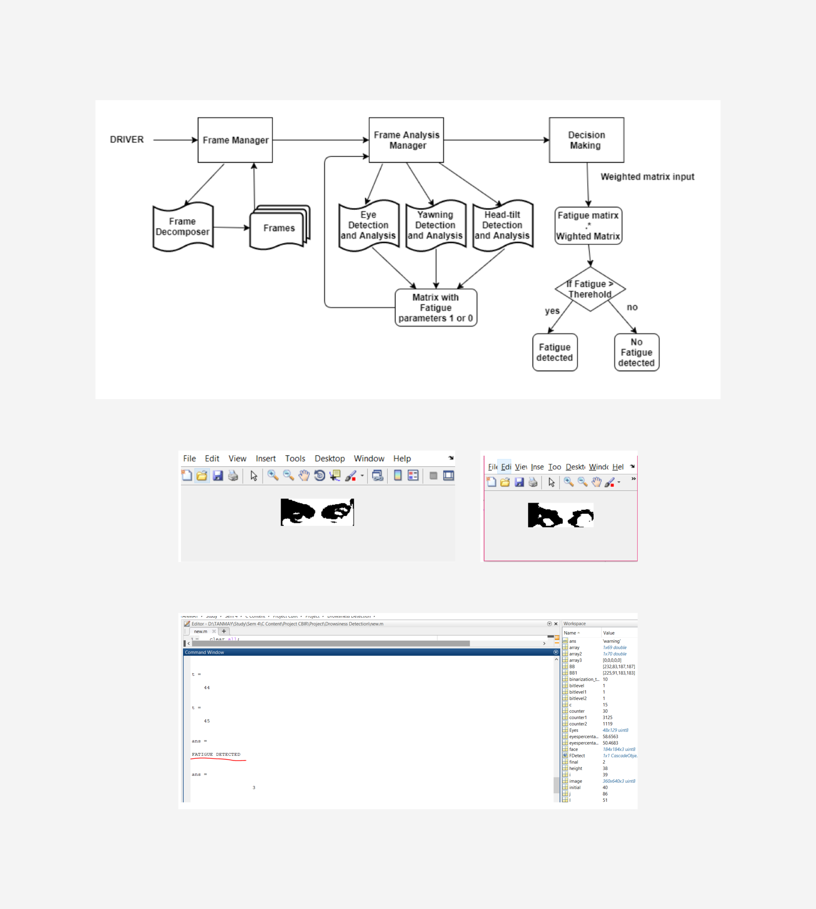

# Drivio-DriverDrowsy

Drivio is a drowsiness checking software embedded in the vehicle's dashboard to detect drowsy driving. It issues alerts to take a break if it suspects you're tired. It is proposed to work on a novel method eye, mouth, and head movement recorded during the drive.

## Motivation
An estimated 1 in 25 adult drivers (aged 18 years or older) report having fallen asleep while driving in the previous 30 days.

The National Highway Traffic Safety Administration estimates that drowsy driving was responsible for 72,000 crashes, 44,000 injuries, and 800 deaths in 2013. However, these numbers are underestimated and up to 6,000 fatal accidents, each year may be caused by drowsy drivers.

Source: www.cdc.gov

**Impact**

Driving while drowsy is similar to driving under the influence of alcoholDriving while drowsy is similar to driving under the influence of alcohol and worsens if the driver is fatigued:

- Reaction time
- Awareness to surroundings
- Ability to Sustain Attention
- **'3 times more likely to be in a car crash.'**

## Implementation
I implemented the checking framework in MATLAB. It is done through the viola jones algorithm for face detection and then further segmenting for eye, mouth, and head movement.

Here the proposed framework incorporates three modules:

- Frame Decomposition
- Frame Analysis
  - Eye Detection
  - Yawning Detection
  - Head tilt Detection
- Decision Making

The final result is obtained by multiplying the fatigue matrix with a weighted matrix to get the cumulative sum of fatigue which determines the outcome. Then the message “Fatigue Detected” is displayed in the MATLAB command hence indicating that the driver is drowsy and he should immediately stop to prevent an accident. The alert also further gets integrated with the dashboard UI and helps display the message on the screen of the car.

